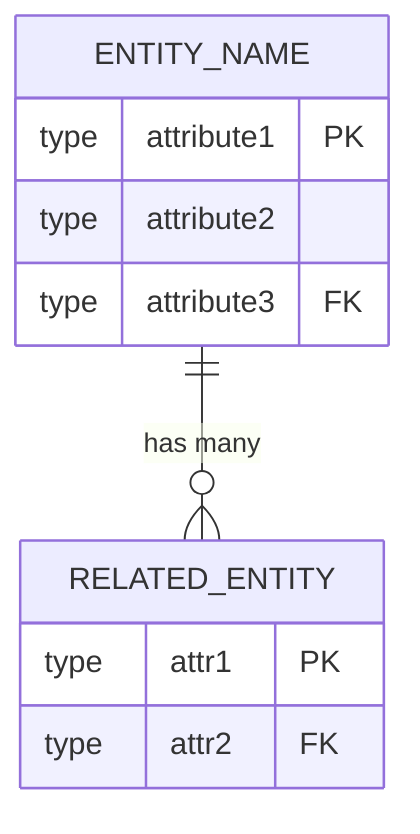

# Data Model: [FEATURE NAME]

## Entity-Relationship Diagram



## Type Mapping

| Entity | Attribute | Type | Constraints | Notes |
|--------|-----------|------|-------------|-------|
| EntityName | attribute1 | type | PK, auto-increment | |
| EntityName | attribute2 | type | NOT NULL | |
| EntityName | attribute3 | type | FK -> RelatedEntity.id | |
| RelatedEntity | attr1 | type | PK | |
| RelatedEntity | attr2 | type | NOT NULL, UNIQUE | |

## Indexes

| Table | Index | Columns | Type |
|-------|-------|---------|------|
| EntityName | idx_attribute3 | attribute3 | B-tree |

## Examples

```json
{
  "entityName": {
    "attribute1": 1,
    "attribute2": "value",
    "attribute3": 10
  }
}
```
