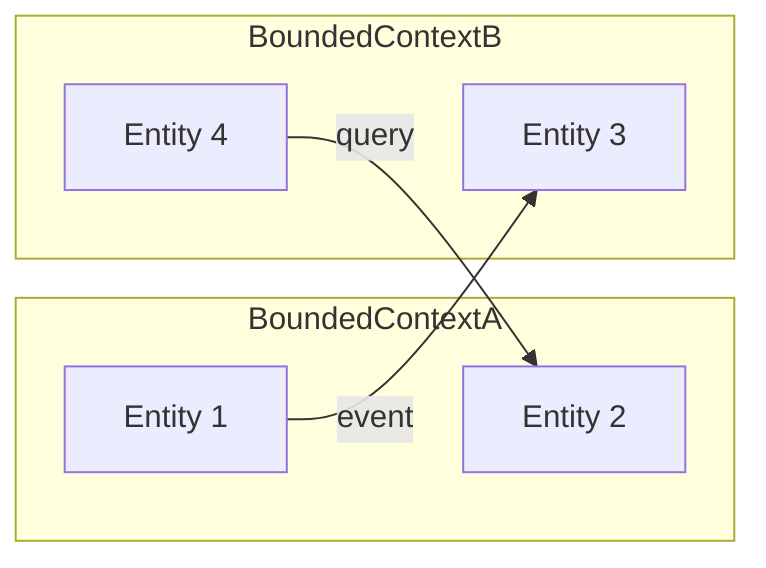

# Domain Map

## Context Diagram

## Bounded Contexts

| Context | Description | Key Entities | Features |
|---------|-------------|--------------|----------|
| context-name | Brief description | Entity1, Entity2 | NNN-name, NNN-name |

## Data Flow

1. Context A emits event when Entity1 changes
2. Context B consumes event and updates Entity3
3. Context B sends query to Context A for Entity2 data

## Integration Points

| Source | Target | Mechanism | Protocol |
|--------|--------|-----------|----------|
| Context A | Context B | Message queue | async / event |
| Context B | Context A | REST API | sync / HTTP |
