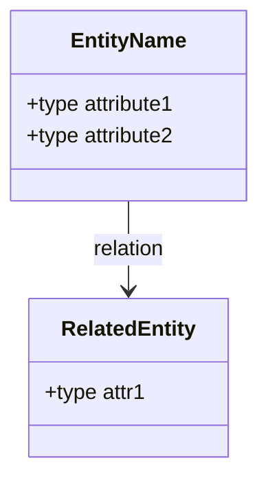

# Feature Specification: [FEATURE NAME]

> Branch: NNN-feature-name
> Status: Draft | Clarifying | Approved

## Input

[Original user request / description of what to build]

---

## User Stories

### P1 - MVP (must have)

As a [role],
I want [capability],
So that [benefit].

Acceptance (Gherkin):
- GIVEN [precondition]
- WHEN [action]
- THEN [expected result]

### P2 - Important (should have)

As a [role],
I want [capability],
So that [benefit].

Acceptance (Gherkin):
- GIVEN [precondition]
- WHEN [action]
- THEN [expected result]

### P3 - Nice to have

As a [role],
I want [capability],
So that [benefit].

---

## Edge Cases

- [Edge case 1]
- [Edge case 2]
- [Edge case 3]

---

## Functional Requirements

| ID | Requirement | Clarification |
|----|-------------|---------------|
| FR-001 | [description] | [NEEDS CLARIFICATION] |
| FR-002 | [description] | |
| FR-003 | [description] | |

---

## Key Entities

| Entity | Description | Key Attributes | Relationships |
|--------|-------------|----------------|---------------|
| [EntityName] | [description] | [attr1, attr2] | [Related] |

---

## Success Criteria

| ID | Criterion | How to verify |
|----|-----------|---------------|
| SC-001 | [measurable outcome] | [test / demo approach] |
| SC-002 | [measurable outcome] | [test / demo approach] |

---

## Assumptions

- [Assumption 1, reasonable default where the user did not specify]
- [Assumption 2]
